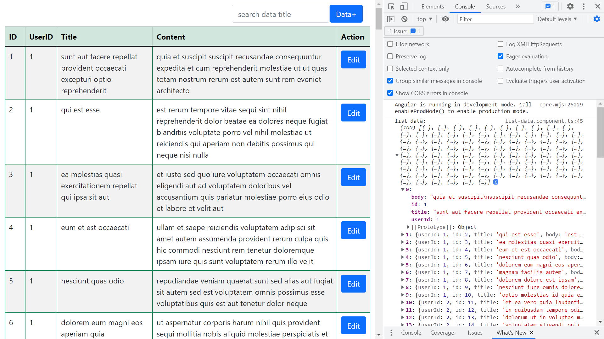

# :zap: Angular API Data

* Angular app to fetch API data and display it in a table using RxJS observables
* Create, Read, Update & Delete (CRUD) operations can be carried out on a table of data fetched from [the JSONPlaceholder API](https://jsonplaceholder.typicode.com/guide/)
* **Note:** to open web links in a new window use: _ctrl+click on link_


## :page_facing_up: Table of contents

* [:zap: Angular API Data](#zap-angular-api-data)
  * [:page\_facing\_up: Table of contents](#page_facing_up-table-of-contents)
  * [:books: General info](#books-general-info)
  * [:camera: Screenshots](#camera-screenshots)
  * [:signal\_strength: Technologies](#signal_strength-technologies)
  * [:floppy\_disk: Setup](#floppy_disk-setup)
  * [:wrench: Testing](#wrench-testing)
  * [:computer: Code Examples](#computer-code-examples)
  * [:cool: Features](#cool-features)
  * [:clipboard: Status, Testing \& To-Do List](#clipboard-status-testing--to-do-list)
  * [:clap: Inspiration](#clap-inspiration)
  * [:file\_folder: License](#file_folder-license)
  * [:envelope: Contact](#envelope-contact)

## :books: General info

* Displays table of API data with CRUD actions using the [JSONPlaceholder API](https://jsonplaceholder.typicode.com/guide/)
* Angular folder structure best practises followed with CRUD service and data pipe in their own folders.
* Bootstrap form used with search filter

## :camera: Screenshots



## :signal_strength: Technologies

* [Angular v16](https://angular.io/) Javascript framework
* [Bootstrap v5](https://getbootstrap.com/)
* [RxJS v7](https://rxjs.dev/) Reactive Extensions Library for JavaScript
* [JSONPlaceholder API](https://jsonplaceholder.typicode.com/guide/)

## :floppy_disk: Setup

* Install dependencies using `npm i`
* Run `ng serve` for a dev server. Frontend will open at `http://localhost:4200/` - refreshes on code changes

## :wrench: Testing

* Run `ng test` to run Jasmine unit tests via [Karma](https://karma-runner.github.io)
* Run `ng e2e` to execute the end-to-end tests via [Protractor](http://www.protractortest.org/).

## :computer: Code Examples

* `data.service.ts` function to get data arry from API

```typescript
  getData(): Observable<Data[]> {
    return this.http.get(this.baseUrl).pipe(
      map((response: any) => {
        return response;
      })
    );
  }
```

## :cool: Features

* Can be connected to a backend database

## :clipboard: Status, Testing & To-Do List

* Status: Working but some erors
* To-Do: Move add & edit data code to their own components with navigation, connect database. Fix 2x filter errors that appear in localhost console. Add form types

## :clap: Inspiration

* [Tektutorialshub: Angular Folder Structure Best Practices](https://www.tektutorialshub.com/angular/angular-folder-structure-best-practices/)

## :file_folder: License

* This project is licensed under the terms of the MIT license.

## :envelope: Contact

* Repo created by [ABateman](https://github.com/AndrewJBateman), email: `gomezbateman@yahoo.com`
